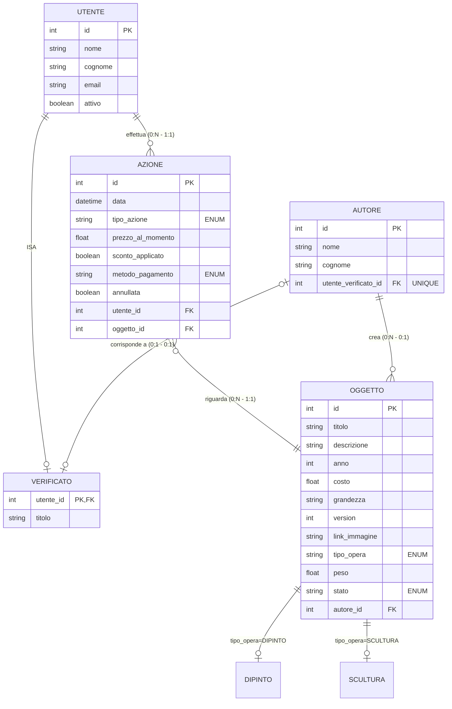

```mermaid
erDiagram
    UTENTE ||--o| VERIFICATO : "ISA"
    UTENTE ||--o{ AZIONE : "effettua (0:N - 1:1)"
    AZIONE }o--|| OGGETTO : "riguarda (0:N - 1:1)"
    AUTORE ||--o{ OGGETTO : "crea (0:N - 0:1)"
    AUTORE |o--o| VERIFICATO : "corrisponde a (0:1 - 0:1)"

%% Generalizzazioni logiche (Single Table nel DB)
    OGGETTO ||--o| DIPINTO : "tipo_opera=DIPINTO"
    OGGETTO ||--o| SCULTURA : "tipo_opera=SCULTURA"

    AUTORE {
        int id PK
        string nome
        string cognome
        int utente_verificato_id FK "UNIQUE"
    }
    OGGETTO {
        int id PK
        string titolo
        string descrizione
        int anno
        float costo
        string grandezza
        int version
        string link_immagine
        string tipo_opera "ENUM"
        float peso
        string stato "ENUM"
        int autore_id FK
    }
    SCULTURA {
    %% Entità logica, dati in OGGETTO
    }
    DIPINTO {
    %% Entità logica, dati in OGGETTO
    }
    UTENTE {
        int id PK
        string nome
        string cognome
        string email
        boolean attivo
    }
    VERIFICATO {
        int utente_id PK, FK
        string titolo
    }
    AZIONE {
        int id PK
        datetime data
        string tipo_azione "ENUM"
        float prezzo_al_momento
        boolean sconto_applicato
        string metodo_pagamento "ENUM"
        boolean annullata
        int utente_id FK
        int oggetto_id FK
    }
```