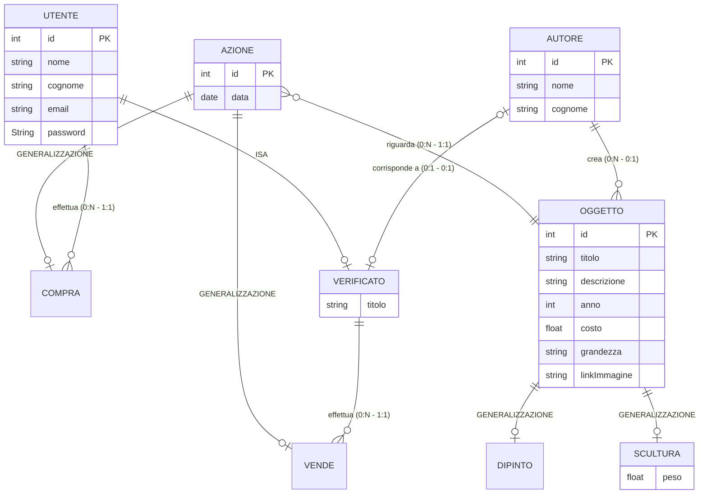

```mermaid
erDiagram
    AZIONE ||--o| COMPRA : "GENERALIZZAZIONE"
    AZIONE ||--o| VENDE : "GENERALIZZAZIONE"
    UTENTE ||--o| VERIFICATO : "ISA"
    OGGETTO ||--o| DIPINTO : "GENERALIZZAZIONE"
    OGGETTO ||--o| SCULTURA : "GENERALIZZAZIONE"

    UTENTE ||--o{ COMPRA : "effettua (0:N - 1:1)"
    VERIFICATO ||--o{ VENDE : "effettua (0:N - 1:1)"
    AZIONE }o--|| OGGETTO : "riguarda (0:N - 1:1)"
    AUTORE ||--o{ OGGETTO : "crea (0:N - 0:1)"
    AUTORE |o--o| VERIFICATO : "corrisponde a (0:1 - 0:1)"

    AUTORE {
        int id PK
        string nome
        string cognome
    }
    OGGETTO {
        int id PK
        string titolo
        string descrizione
        int anno
        float costo
        string grandezza
        string linkImmagine
    }
    SCULTURA {
        float peso
    }
    DIPINTO {
    }
    UTENTE {
        int id PK
        string nome
        string cognome
        string email
        String password
    }
    VERIFICATO {
        string titolo
    }
    AZIONE {
        int id PK
        date data
    }
    COMPRA {
    }
    VENDE {
    }
```